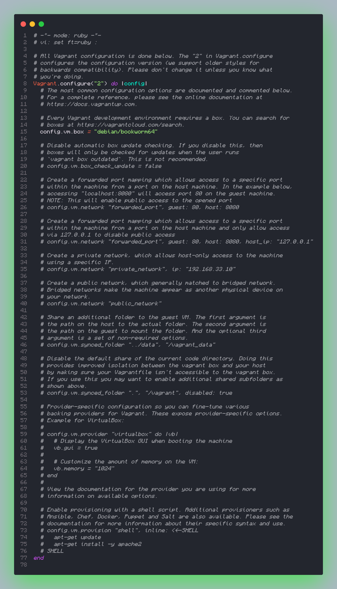
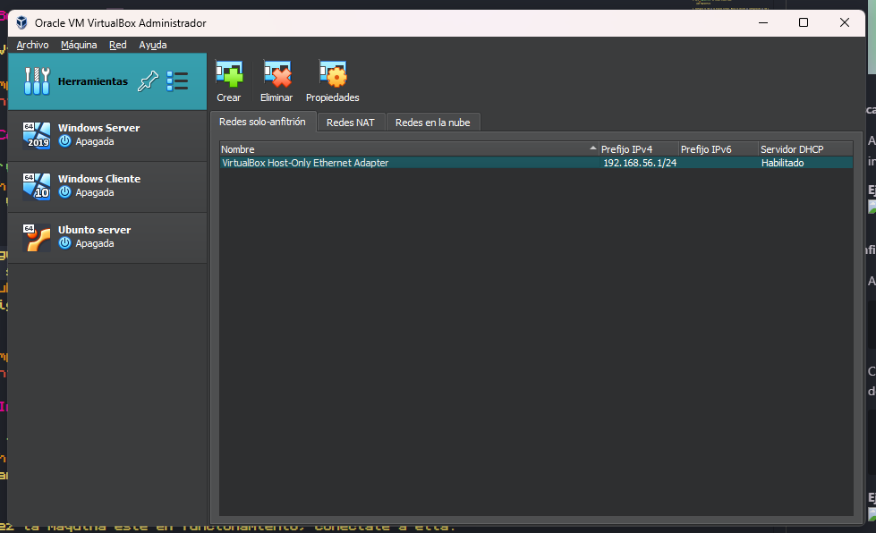
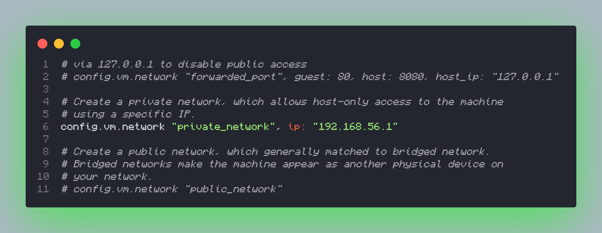
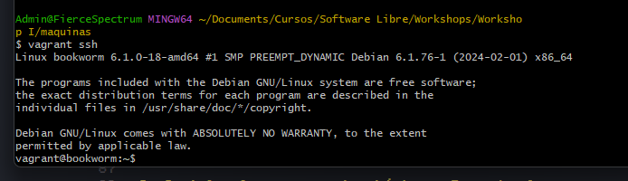
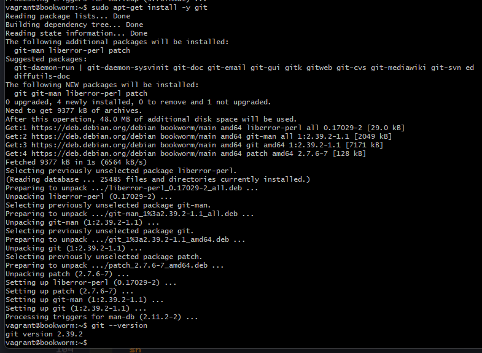
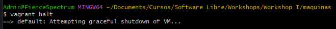

# Workshop 1

## Creación de una máquina virtual con Vagrant

### Pasos a seguir

#### 1. Descarga e instalación de VirtualBox

1. Descarga VirtualBox desde [la página oficial](https://www.virtualbox.org/wiki/Downloads).
2. Sigue las instrucciones de instalación para tu sistema operativo.

#### 2. Descarga e instalación de Vagrant

1. Descarga Vagrant desde [la página oficial](https://www.vagrantup.com/downloads).
2. Sigue las instrucciones de instalación para tu sistema operativo.

#### 3. Creando el entorno de trabajo

1. Crear una carpeta llamada `Workshop 1`:
    ```sh
    mkdir Workshop1
    cd Workshop1
    ```

2. Dentro de esta carpeta, crea un archivo README (este archivo que estás leyendo).

3. **Ejemplo de estructura de carpetas**:

    

#### 4. Creando el archivo de configuración de la máquina virtual

1. Inicializa un nuevo proyecto de Vagrant:
    ```sh
    vagrant init debian/bookworm64
    ```

2. Esto creará un archivo `Vagrantfile` en tu directorio de trabajo.

3. **Ejemplo de archivo Vagrantfile inicial**:
    

#### 5. Buscar la IP de red en VirtualBox

1. Abre VirtualBox y busca la IP que tiene por defecto para conectarse a internet.

2. **Ejemplo de configuración de red en VirtualBox**:
    

#### 6. Configurando la máquina virtual

1. Abre `Vagrantfile` en Visual Studio Code:
    ```sh
    code Vagrantfile
    ```

2. Configura la red de la máquina virtual. Busca la sección de configuración de red y añade la siguiente línea:
    ```ruby
    config.vm.network "private_network", ip: "192.168.56.1"
    ```

3. **Ejemplo de configuración de red en Vagrantfile**:
    

#### 7. Iniciando la máquina virtual

1. En tu terminal, dentro del directorio `Workshop1`, ejecuta:
    ```sh
    vagrant up
    ```

2. Una vez la máquina esté en funcionamiento, conéctate a ella:
    ```sh
    vagrant ssh
    ```

3. **Ejemplo de conexión exitosa a la máquina virtual**:
    

#### 8. Instalando paquetes básicos

1. Actualiza la lista de paquetes y el sistema:
    ```sh
    sudo apt-get update
    sudo apt-get upgrade
    ```

2. Instala algunos paquetes básicos. Por ejemplo:
    ```sh
    sudo apt-get install -y git
    ```

3. Verifica que los paquetes se han instalado correctamente:
    ```sh
    git --version
    ```

4. **Ejemplo de instalación y verificación de paquetes**:
    

#### 9. Finalizando

1. Para salir de la máquina virtual:
    ```sh
    exit
    ```

2. Para detener la máquina virtual:
    ```sh
    vagrant halt
    ```

3. **Ejemplo de comandos para finalizar la máquina virtual**:
    

¡Y eso es todo! Ahora has configurado y trabajado con una máquina virtual Debian usando Vagrant.

[My GitHub](https://github.com/FierceSpectrum/Software-Libre/tree/main/Workshops/Workshop%20I)