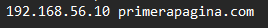
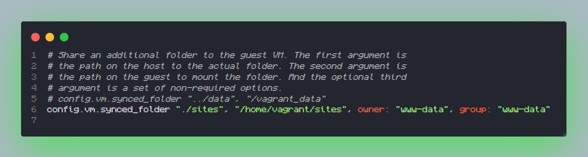
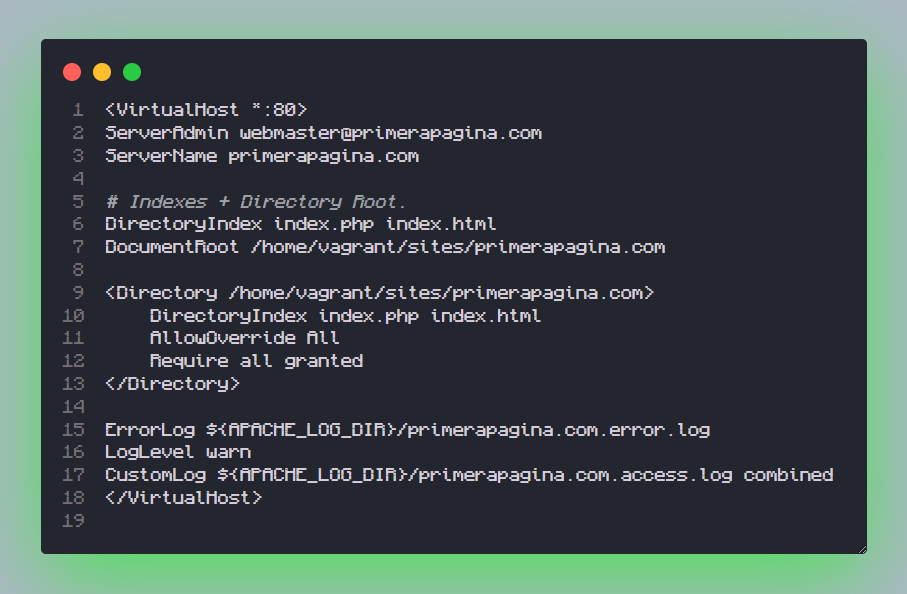

# Workshop II

## Modificacion de la maquina virtual del Workshop I pra que funcione como WebServer

### Pasos a seguir

#### 1. Simulación de un Dominio de Forma Local

Para simular un dominio es:
1. Editar el archivo host de la maquina anfitriona.

En Windows se ubica en: 
```PoweShell
    C:\Windows\System32\drivers\etc\hosts
```
En Linux: 
```bash
    /etc/hosts
```
Nota: Se requiere usar permisos de administrador para la modificar este archivo.

```bash
    sudo nano /etc/hosts
```

Añadir la siguiente línea al archivo hosts:
```sh
    192.168.56.10 primerapagina.com
```

2. **Ejemplo de como se veria la carpeta hosts:**
    
    

#### 2. Sincronizar una Carpeta Extra a la VM
1. Creamos una rchivo llamado sites a la par del VagrantFile de la maquina virtual WebServer.

``` sh
    mkdir sites
```

2. Abrimos el VagrantFile y añadimos el siguiente código para añadir la carpeta sites a la máquina virtual de forma compartida y sincronizada:
```sh
    code VagrantFile
```
Dentro de VagrantFile ingresamos:
```ruby
    config.vm.synced_folder "./sites", "/home/vagrant/sites", owner: "www-data", group: "www-data"
```
Donde "www-data" es el grupo de pertenencia de Apache2 dentro de Linux.

3. **Ejemplo del archivo VagrantFile**:
    

#### 3. Configuración de Apache para Resolver Diferentes Dominios
1. En la máquina virtual crearemos las carpetas necesarias para los sitios y la configuración:

```bash
    sudo mkdir /var/www/html/primerapagina.com
    sudo mkdir /etc/apache2/sites-available
```
*Crear el Archivo de Configuración para el Dominio*

2. Crear un archivo de configuración para el dominio:

```bash
    sudo nano /etc/apache2/sites-available/primerapagina.com.conf
```

3. Añadir el siguiente contenido al archivo de configuración:

```php
    <VirtualHost *:80>
        ServerAdmin webmaster@primerapagina.com
        ServerName primerapagina.com
        ServerAlias www.primerapagina.com
        DocumentRoot /var/www/html/primerapagina.com
        ErrorLog ${APACHE_LOG_DIR}/error.log
        CustomLog ${APACHE_LOG_DIR}/access.log combined
    </VirtualHost>
```

4. Habilitar el Sitio y Reiniciar Apache

```bash
    sudo a2ensite primerapagina.com.conf
    sudo systemctl reload apache2
```

5. **Ejemplo del contenido del archivo de configuracion de la pagina**:
    

#### 4. Creación y Configuración de la Página Web
1. Crear una pagina dentro de la carpeta del dominio:

    * En la maquina anfitriona dentro del archivo donde tenermos el Vagrantfile ir a la carpeta de site y entrar a la carpeta primerapagina.com y dentro de estra montar la pagina.

3. **Ejemplo de una pagina web**:
    


#### 5. Pruebas de Acceso
1. Desde la máquina anfitriona, acceder a la URL http://primerapagina.com y verificar que se muestra la página con el mensaje "Hola Mundo".

2. Crearemos subpáginas dentro del dominio:

```bash
    sudo mkdir /var/www/html/primerapagina.com/pagina1
    sudo mkdir /var/www/html/primerapagina.com/pagina2

    echo "<h1>Página 1</h1>" | sudo tee /var/www/html/primerapagina.com/pagina1/index.html
    echo "<h1>Página 2</h1>" | sudo tee /var/www/html/primerapagina.com/pagina2/index.html
```

3. Acceder a http://primerapagina.com/pagina1 y http://primerapagina.com/pagina2 para verificar que las subpáginas se muestran correctamente.


[My GitHub](https://github.com/FierceSpectrum/Software-Libre/tree/main/Workshops/Workshop%20II)