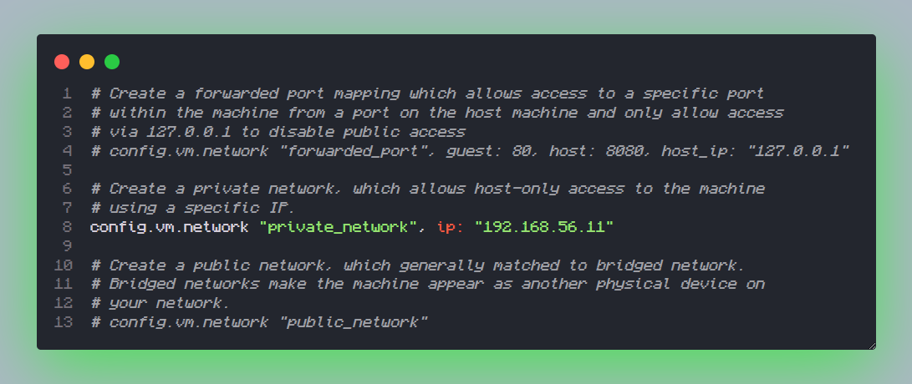
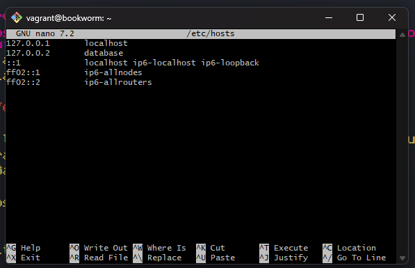
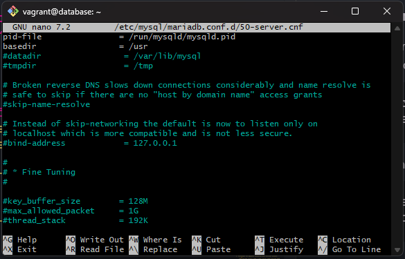
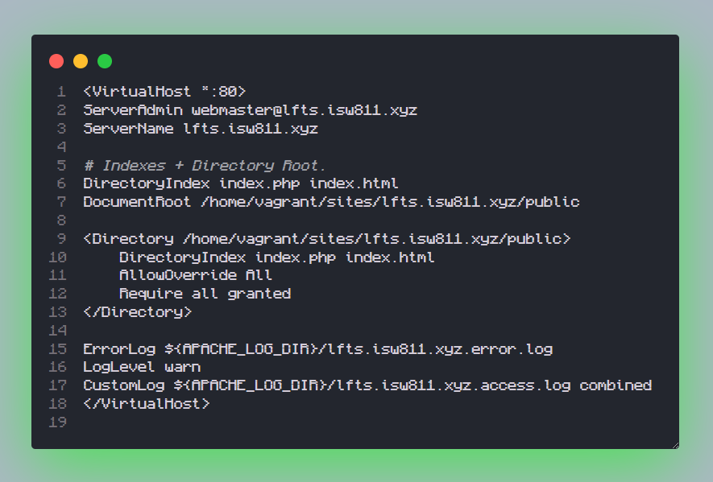
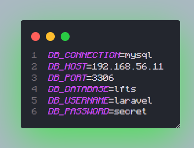
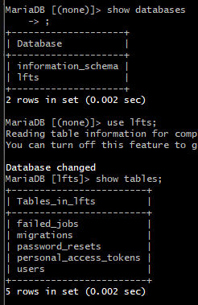
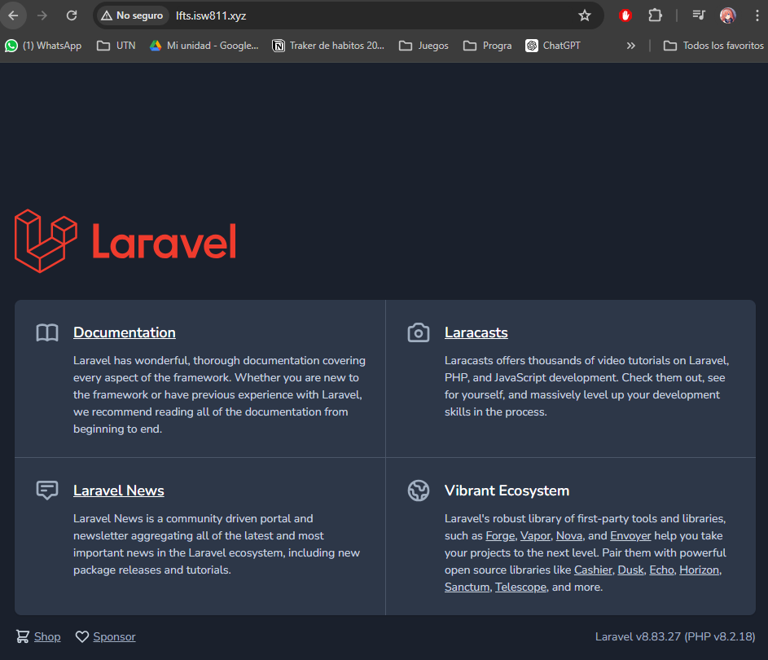

# Workshop 3

## Crear un servidor Debian con Base de Datos y conectarlo con el WebServer del workshop II

### Pasos a seguir

#### 1. Encendemos la máquina virtual WebServer
Maquina Anfritiona
```sh
    vagrant shh
```

Maquina virtual
```sh
    sudo apachectl -S
```
Esto confirmará que el servidor Apache está funcionando correctamente y te mostrará la configuración del servidor.
#### 2. Creamos otra máquina virtual para la Base de Datos

1. Creamos una carpeta nueva dentro de nuestra carpeta donde están las máquinas virtuales y entramos a dicha carpeta ya creada.

```sh
    mkdir database
    cd database
```
2. Creamos un nuevo Vagrantfile para la máquina virtual con **Debian**.
```sh
    vagrant init debian/bookworm64
```
3. Abrimos el archivo Vagrantfile en [VS Code](https://code.visualstudio.com/) y editamos la línea 35 para ponerle una IP **Diferente** a la máquina WebServer que tiene la IP "192.168.56.10". La nueva máquina tendrá la IP "192.168.56.11".
```sh
    code Vagrantfile
```
4. Encendemos la **nueva** máquina virtual.
```sh
    vagrant up
```
5. **Ejemplo del archivo Vagrantfile.**
    

### 3. Cambiamos el nombre del usuario/máquina para no confundirlo con las otras máquinas virtuales.
1. Abrimos el archivo de la **nueva** máquina donde está el nombre de esta y le cambiamos el nombre por **"database"**.
```sh
    sudo nano /etc/hosts
```
2. Hacemos que la máquina detecte el cambio y nos salimos de la máquina y volvemos a entrar.
    * Maquina DataBase
        ```sh
        sudo hostnamectl set-hostname database
        exit
        ```
    * Maquina Anfritiona
        ```sh
        vagrant ssh
        ```

3. **Ejemplo de estructura de carpetas para cambiar el nombre**:

    

4. Realizamos el cambio del nombre de la misma forma con la máquina WebServer.
    ```sh
    sudo nano /etc/hosts
    ```
    * Maquina WebServer
        ```sh
        sudo hostnamectl set-hostname webserver
        exit
        ```
    * Maquina Anfritiona
        ```sh
        vagrant ssh
        ```
        
### 4. Instalamos los paquetes necesarios para configurar nuestra máquina y hacerla una Base de Datos.
1. Actualizamos los paquetes disponibles.
```sh
    sudo apt-get update
```
2. Instalamos los paquetes necesarios para tener una base de datos MySQL (MariaDB en este caso).
```sh
    sudo apt-get install mariadb-server mariadb-client
    mysql --version
```

3. Ejecutamos MySQL y empezamos a configurarlo.
```sh
    sudo mysql
```
* En MySQL:
    1. Vemos las bases de datos creadas.
        ```SQL
        show databases;
        ```
    2. Vemos los usuarios creados y creamos uno que vamos a utilizar para que la máquina WebServer se conecte.
        ```SQL
        desc mysql.user;
        Select Host, User, Password from mysql.user;
        Create user laravel;

        Create user laravel2@'localhost';
        Drop user laravel2@'localhost';
        Drop user laravel;

        Create user laravel identified by 'secret';
        Set password for laravel = password('secret2');
        Set password for laravel = password('secret');
        ```
    3. Creamos la base de datos que va a utilizar la máquina WebServer.
        ```SQL
        Create database lfts;
        ```
    4. Le asignamos permisos al usuario que creamos anteriormente, refrescamos los privilegios y nos salimos de MySQL.
        ```SQL
        Grant all privileges on lfts.* to laravel;
        show grants for laravel;

        Flush privileges;

        exit
        ```
4. Probamos que funcione el usuario y vemos que bases de datos podemos utilizar.
    ```sh
    mysql -u laravel -p
    secret

    Show databases;

    exit
    ```

### 5. Accedemos desde la máquina WebServer a la base de datos.
1. Primero instalamos en la máquina WebServer los paquetes de MySQL, solo el cliente porque con este nos conectamos.
    ```sh
    sudo apt-get install mariadb-client
    mysql --version
    ```
2. Nos intentamos conectar a la máquina DataBase con el usuario que creamos.
    ```sh
    mysql -h 192.168.56.11 -u laravel -p
    secret
    ```

3. Vemos que no nos podemos conectar porque no hemos configurado la máquina DataBase para que permita las conexiones desde afuera.
    ```sh
    sudo nano /etc/mysql/mariadb.conf.d/50-server.cnf
    ```
    * Comentamos la línea:
        ```sh
        #bind--adress             =127.0.0.1
        ```
    * Reiniciamos el servicio MySQL.
        ```sh
        sudo systemctl restart mysql
        ```
    
4. **Ejemplo del archivo de servidor.**
    

5. Volvemos a conectarnos desde la máquina WebServer ahora que modificamos el archivo de configuración para permitir la conexión externa.
    ```sh
    mysql -h 192.168.56.11 -u laravel -p
    secret

    # In MySQL:
        exit
    ```
### 6. Instalamos paquetes para poder hacer páginas con PHP usando Laravel.
1. Instalamos los paquetes necesarios para utilizar Laravel.
    ```sh
    sudo apt-get install php8.2 php8.2-mysql php8.2-mcrypt php8.2-memcache php8.2-bcmath php8.2-zip php8.2-curl php8.2-xml
    ```
2. Instalamos Composer para gestionar dependencias PHP.
    ```sh
    php -r "copy('https://getcomposer.org/installer', 'composer-setup.php');"
    php -r "if (hash_file('sha384', 'composer-setup.php') === 'dac665fdc30fdd8ec78b38b9800061b4150413ff2e3b6f88543c636f7cd84f6db9189d43a81e5503cda447da73c7e5b6') { echo 'Installer verified'; } else { echo 'Installer corrupt'; unlink('composer-setup.php'); } echo PHP_EOL;"
    php composer-setup.php
    php -r "unlink('composer-setup.php');"
    ```
3. Creamos una carpeta para Composer y movemos algunos archivos a esa carpeta.
    ```sh
    sudo mkdir -p /opt/composer
    sudo mv composer.phar /opt/composer/
    ```
4. Creamos una acceso directo para el archivo composer.phar.
    ```sh
    ls -la /usr/local/bin/c*
    sudo ln -s /opt/composer/composer.phar /usr/local/bin/composer
    ```
5. Instalamos NVM (Node Version Manager) para gestionar versiones de Node.js.
    * Instalamos curl
        ```sh
        sudo apt-get install curl
        curl ifconfig.me
        ```
    * Instalamos NVM
        ```sh
        curl -o- https://raw.githubusercontent.com/nvm-sh/nvm/v0.39.7/install.sh | bash
        ```
    * Salimos y volvemos a ingresar.
        * Maquina WebServer
            ```sh
            exit
            ```
        * Maquina Anfritiona
            ```sh
            vagrant ssh
            ```
        
    * Verificamos la instalación.
        ```sh
        nvm ls-remote
        nvm install --lts
        node -v
        npm -v
        ```
6. Creamos el proyecto Laravel en la carpeta compartida entre la máquina anfitriona y la máquina virtual.
    ```sh
    cd /vagrant/sites
    composer create-project laravel/laravel=8.6.12 lfts.isw811.xyz
    ```
### 7. Configuramos Apache para servir el proyecto Laravel.
1. Creamos una nueva configuración de VirtualHost para Apache.
    ```sh
    sudo nano /etc/apache2/sites-available/lfts.isw811.xyz.conf
    ```
    * Agregamos el siguiente contenido:
        ```html
        <VirtualHost *:80>
            ServerAdmin webmaster@lfts.isw811.xyz
            ServerName lfts.isw811.xyz

            # Indexes + Directory Root.
            DirectoryIndex index.php index.html
            DocumentRoot /home/vagrant/sites/lfts.isw811.xyz/public

            <Directory /home/vagrant/sites/lfts.isw811.xyz/public>
                DirectoryIndex index.php index.html
                AllowOverride All
                Require all granted
            </Directory>

            ErrorLog ${APACHE_LOG_DIR}/lfts.isw811.xyz.error.log
            LogLevel warn
            CustomLog ${APACHE_LOG_DIR}/lfts.isw811.xyz.access.log combined
        </VirtualHost>
        ```
2. **Ejemplo del archivo configuracion**
    

3. Activamos el sitio y recargamos Apache.
    ```sh
    sudo cp lfts.isw811.xyz.conf /etc/apache2/sites-avaliable/
    sudo apachectl -t
    sudo a2ensite lfts.isw811.xyz.conf
    sudo apachectl -t
    sudo systemctl reload apache2
    ```

4. Verificamos la instalación de Composer y ajustamos el archivo de configuración .env de Laravel para conectarse a la base de datos.
    ```sh
    cd /vagrant/sites/lfts.isw811.xyz
    nano .env
    ```
    * Configuramos las siguientes variables:
        ```sh
        DB_CONNECTION=mysql
        DB_HOST=192.168.56.11
        DB_PORT=3306
        DB_DATABASE=lfts
        DB_USERNAME=laravel
        DB_PASSWORD=secret
        ```
5. **Ejemplo del archivo .env**

    

6. Ejecutamos las migraciones de Laravel para crear las tablas en la base de datos.
    ```sh
    composer --global config process-timeout 2000
    php artisan migrate
    ```
### 8. Revisamos si se crearon las tablas correctamente.
1. Nos conectamos desde la maquina Webserver a la base de datos.
    ```sh
    sudo -h 192.168.56.11 -laravel -p
    secret
    ```

   * En MySQL
        ```SQL
        show databases;
        use lfts;
        show tables;
        ```
2. **Ejemplo del las tablas**
    
    

### 9. Ver nuestro trabajo.
1. Podemos ver la pagina de laravel llendo a la ruta [lfts.isw811.xyz](http://lfts.isw811.xyz)

2. **Ejemplo del la pagina con Laravel**
    


¡Listo! Ahora tienes una máquina Debian configurada como servidor de base de datos conectada con el WebServer usando Laravel. Asegúrate de probar tu sitio web en un navegador para verificar que todo funcione correctamente.

[My GitHub](https://github.com/FierceSpectrum/Software-Libre/tree/main/Workshops/Workshop%20III)