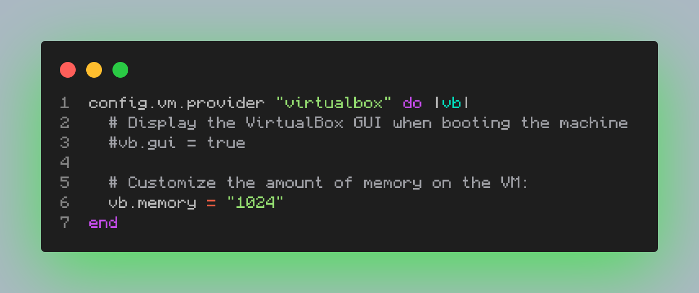

# Workshop 4

## Actualizar la página creada con Composer y agregarle algunas mejoras

### Pasos a seguir

#### 1. Aumentar la RAM de la máquina webserver.
1. Abrimos el archivo **`Vagrantfile`** de la máquina webserver:

```sh
code Vagrantfile
```

2. Descomentamos y modificamos las líneas de la 60 a la 66:

```Vagrantfile
config.vm.provider "virtualbox" do |vb|
# Display the VirtualBox GUI when booting the machine
#vb.gui = true

# Customize the amount of memory on the VM:
vb.memory = "1024"
end
```

3. **Ejemplo del archivo Vagrantfile:**:
    

### 2. Descargar una versión de Node compatible con la versión de Laravel

1. Descargamos la versión 18.20.3 de Node:

```sh
nvm install --lts=hydrogen
```

2. Configuramos Node para utilizar la versión previamente instalada por defecto:

```sh
node -v
nvm alias default v18.20.3
```

### 3. Actualizar Laravel para que utilice un UI y poder usar Bootstrap

1. Actualizamos el proyecto de Laravel para que utilice un UI:

```sh
cd /vagrant/sites/lfst.isw811.xyz
Composer require laravel/ui:3.4.6
```

2. Hacemos que PHP utilice Bootstrap:

```sh
php artisan ui bootstrap
```

### 4. niciar una instalación de paquetes para la página de Laravel
1. Iniciamos una instalación:
```sh
npm install
```

2. Ejecutamos el proyecto:
```sh
npm run dev
```

3. Repetimos los dos pasos anteriores:
```sh
npm install && npm run dev
```

4. Actualizamos todo el proyecto:
```sh
php artisan ui bootstrap --auth
```

#### **NOTA**: Podemos, con otra terminal, entrar a la máquina webserver y mientras realizamos la instalación de paquetes, podemos ver cuánta memoria está utilizando:
```sh
free -h
```

### Si deseas aprender o practicar algunos comandos de Linux, puedes jugar en una terminal con los siguientes pasos:
1. Clona el siguiente repositorio:
```sh
git clone https://gitlab.com/slackermedia/bashcrawl.git Juego
```

2. Entra a la carpeta donde clonaste el repositorio, que en este caso sería **`Juego`**:
```sh
cd Juego
```
3. Lee los archivos **`scroll`**, te dan información relevante:
```sh
cat scroll
```

¡Listo! Ahora tienes más RAM en tu máquina virtual y la página creada con Laravel utilizando Bootstrap.

[My GitHub](https://github.com/FierceSpectrum/Software-Libre/tree/main/Workshops/Workshop%20IV)
